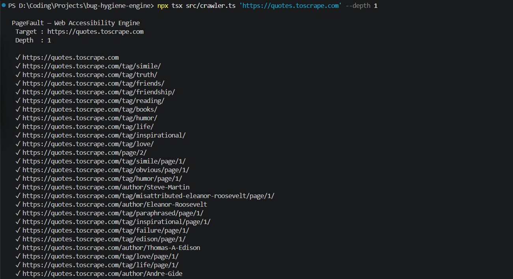
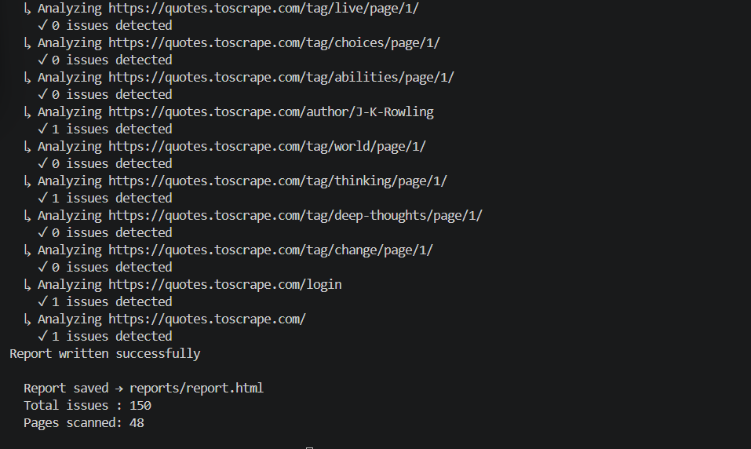
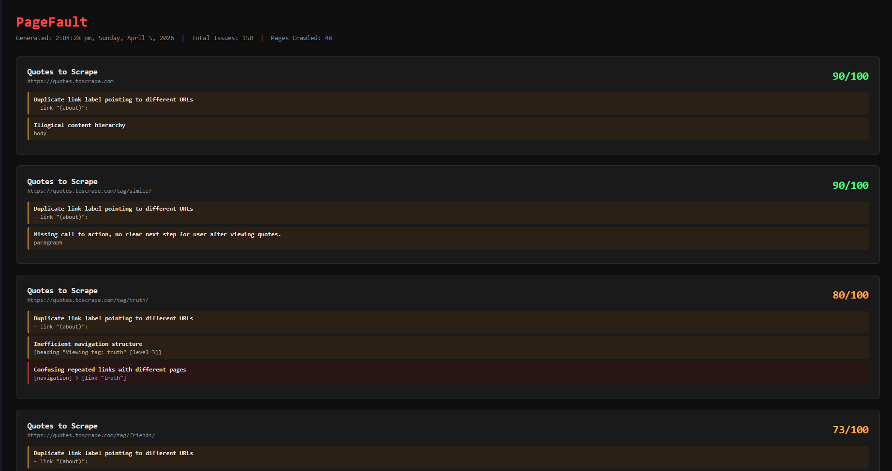

# PageFault

> A multi-agent web accessibility and hygiene engine that autonomously crawls, analyzes, and classifies defects — essentially a self-driven QA inspector.

---

## What is this?

PageFault crawls any web page, grabs its ARIA accessibility snapshot, runs it through rule-based detectors, and then passes it to a local LLM for holistic UX analysis. Each page gets a hygiene score based on issue density and severity.

No screenshots. No vision models. Just structured analysis of what the browser actually exposes — rule-based detection first, LLM augmentation second.

---

## Architecture

PageFault is built as a pipeline of five agents, orchestrated by `crawler.ts`:
```
CrawlerAgent → DetectorAgent → AnalyzerAgent → ScorerAgent → ReporterAgent
```

1. **CrawlerAgent** — Playwright launches a browser, navigates each URL, captures the ARIA snapshot, and follows internal links up to a configurable depth limit.

2. **DetectorAgent** — The snapshot is passed through 8 rule-based detectors. Fast, reliable, zero hallucination. Runs on the full snapshot.

3. **AnalyzerAgent** — A local LLM (Mistral via Ollama) analyzes the snapshot holistically for issues rules can't catch — confusing navigation structure, missing calls to action, illogical content hierarchy, poor semantic flow. Runs on the first 4000 characters of the snapshot (deliberate tradeoff — partial coverage with full context is preferred over chunked coverage with fragmented context for holistic analysis).

4. **ScorerAgent** — Computes a hygiene score per page: 100 base, -10 per high severity issue, -5 per medium, -2 per low. Minimum 0.

5. **ReporterAgent** — Outputs structured JSON and an HTML report to `reports/`.

---

## Detectors

| Detector | What it catches |
|---|---|
| `detectVagueLinkText` | Links with non-descriptive labels like "click here", "read more" |
| `detectMissingDescription` | Images with no alt text, links with no readable label |
| `detectBrokenLinks` | Empty URLs or `javascript:void(0)` links |
| `detectButtonWithNoTextLabels` | Buttons with empty or missing label text |
| `detectLinkWithDuplicateValues` | Same link label pointing to different URLs |
| `detectHeadingHierarchyViolation` | Headings that skip levels (h1 → h3) |
| `detectMultipleH1` | Pages with more than one h1 |
| `detectUnlabelledFormFields` | Form inputs with no associated label |

---

## Usage

**Prerequisites:**
- Node.js
- [Ollama](https://ollama.com) running locally with Mistral pulled:
```bash
  ollama pull mistral
```

**Install:**
```bash
npm install
npx playwright install firefox
```

**Run:**
```bash
npx tsx src/crawler.ts <url> --depth <n>
```

Example:
```bash
npx tsx src/crawler.ts https://example.com --depth 2
```

Reports are written to `reports/report.json` and `reports/report.html`.

---

## Sample Output

```json
{
  "url": "https://quotes.toscrape.com",
  "score": 88,
  "issueCount": 3,
  "issues": [
    {
      "element": "- link \"(about)\":",
      "issue": "Duplicate link label pointing to different URLs",
      "severity": "medium"
    }
  ]
}
```

---

## Deliberate Tradeoffs

- **Rule-based first, LLM second** — detectors run on the full snapshot with guaranteed output. The LLM is additive, not a replacement. If the LLM fails, the engine still produces a complete report.
- **4000 char snapshot truncation** — local models lose instruction-following ability on large contexts. Truncation trades coverage for reliability. Full snapshot support planned with cloud model integration.
- **Graceful degradation** — LLM failures are caught and retried up to 3 times. On exhaustion, the page report is built from rule-based results only.

---

## Focus Areas

| Area | Status |
|---|---|
| Bug Detection | 🟢 8 detectors live |
| Hygiene Scoring | 🟢 Severity-weighted per page |
| Autonomous Discovery | 🟢 Depth-configurable crawling |
| AI Agents | 🟢 5-agent pipeline with local LLM |
| HTML Reporting | 🟢 Template-based report generation |
| Defect Knowledge Graph | ⬜ Planned (Neo4j) |
| Visualization Dashboard | ⬜ Planned |
| Mobile Testing | ⬜ Planned |

---

## Roadmap

- [ ] Neo4j knowledge graph: pages → elements → issue types → severity
- [ ] Detector fine-tuning to reduce false positives
- [ ] Cloud model support for full snapshot analysis
- [ ] Visualization dashboard
- [ ] Mobile testing support

---

## Stack

- [Playwright](https://playwright.dev) — browser automation + ARIA snapshots
- [Ollama](https://ollama.com) + Mistral — local LLM for holistic UX analysis
- TypeScript — because types catch bugs before runtime does
- Commander — CLI interface

---

## Screenshots

- Crawling Webpages:


- Detection and reporting of bugs:


- Reports on localhost website and scoring of webpages:
